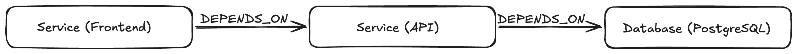
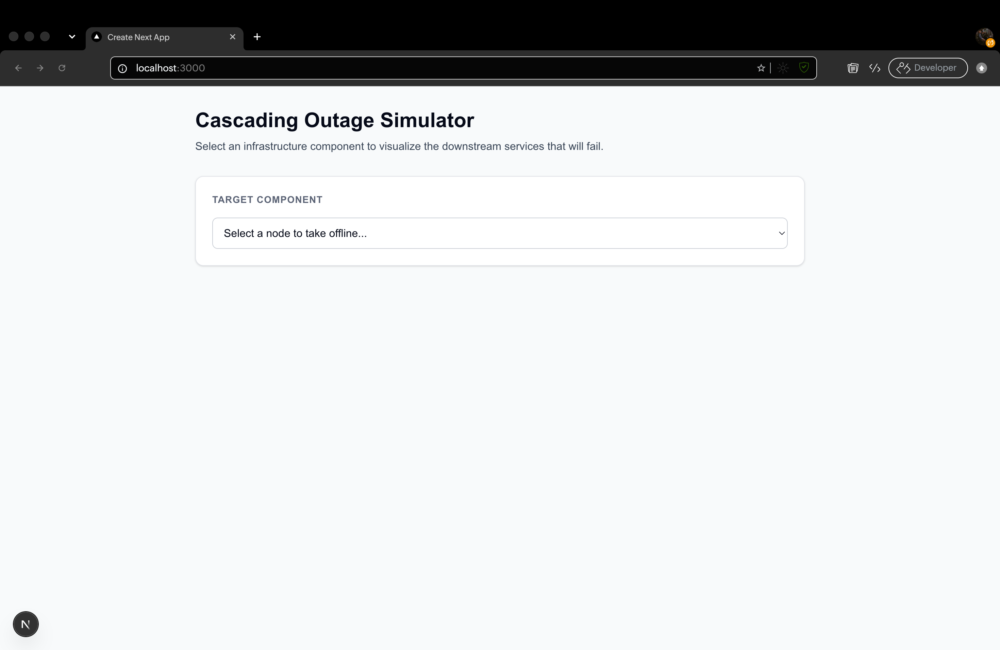
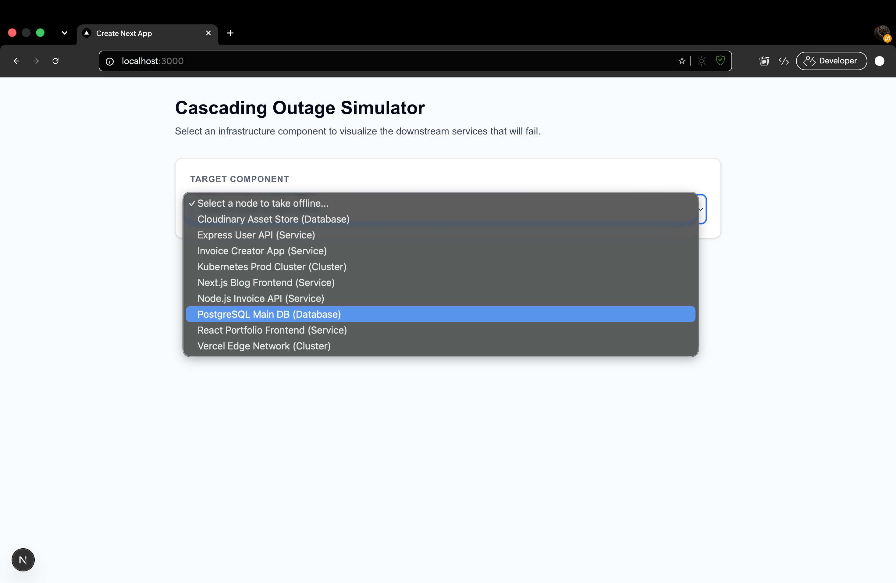
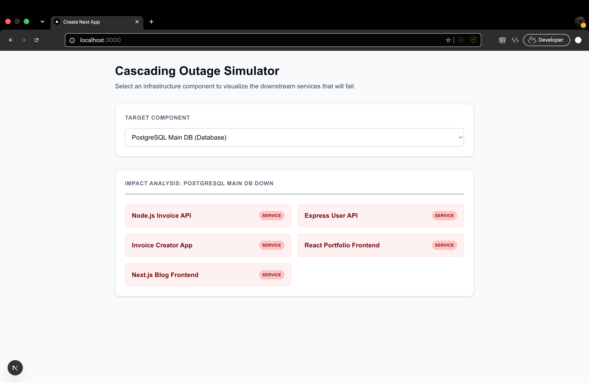

# DevOps Infrastructure Mapper

A full-stack application built with Next.js and CognoDB (Neo4j) to visualize cascading failure impact in cloud infrastructure.

## Why a Graph Database?
Relational databases struggle with highly connected, multi-layered data. If a PostgreSQL database goes down, finding every single frontend application that indirectly depends on it (e.g., Frontend -> API Gateway -> Auth Service -> Database) requires complex, recursive SQL `JOIN`s that degrade in performance. 

A graph database treats these dependencies as first-class citizens. By modeling infrastructure as nodes (`Service`, `Database`, `Cluster`) and connections as relationships (`DEPENDS_ON`, `DEPLOYED_IN`), we can execute a multi-hop traversal in milliseconds using a simple Cypher query.

## The Multi-Hop Query Explained
When a user selects a node to simulate an outage, the application runs this variable-length path traversal:

```cypher
MATCH (affected)-[:DEPENDS_ON|DEPLOYED_IN*1..5]->(target {name: $outageNode})
RETURN DISTINCT affected.name AS name, labels(affected)[0] AS type
```
This query starts at the `$outageNode` and traverses *backwards* along any `DEPENDS_ON` or `DEPLOYED_IN` relationships for up to 5 hops, finding every downstream component affected by the outage.

## Local Setup
1. Clone the repository and run `npm install`.
2. Create a `.env` file with your CognoDB credentials:
   - `NEO4J_URI=bolt+s://...`
   - `NEO4J_USER=cognodb`
   - `NEO4J_PASSWORD=...`
3. Run the seed script to populate the database: `node scripts/seed.js`
4. Start the development server: `npm run dev`

## Application Visuals

**Graph Data Model:**


**Application UI (Empty State):**


**Application UI (Dropdown Options):**


**Application UI (Outage State):**
